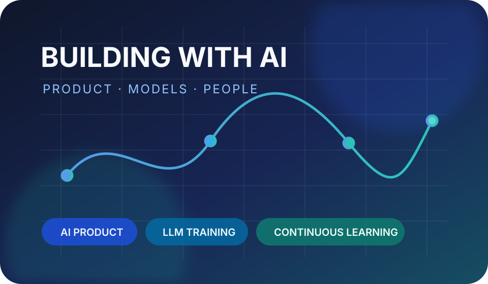
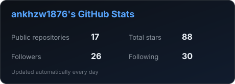
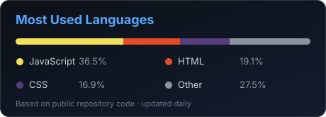

<h1 align="center">
  Hi there 👋 This is 🍤咀嚼虾滑!
</h1>

  AI Product · LLM Training · Continuous Learning

  

### About me

Welcome to my GitHub page! I am exploring AI products and large language model applications, with a focus on turning model capabilities into useful, measurable products.

#### 🌱 Things I am currently working on

- Building a structured knowledge system for AI product management
- Learning the complete LLM fine-tuning workflow
- Practicing dataset design, evaluation and model iteration
- Preparing reusable notes and hands-on AI projects

#### ⚡ Things I am interested in

- AI Product Management
- Large Language Models
- SFT, LoRA and QLoRA
- RAG and AI Agents
- Dataset strategy and model evaluation
- Human-centered AI products

 

### 🚀 Featured projects

- [AI Concept XHS Skill](https://github.com/ankhzw1876/ai-concept-xhs-skill) — Verified AI concept explainers and knowledge-map cards
- [Joker Game](https://github.com/ankhzw1876/joker-game) — A browser-based game project

### 🧰 Languages and tools

  
  
  
  
  
  
  

### 📊 GitHub stats

  
  

---

  Keep learning, keep building, and make AI useful.

